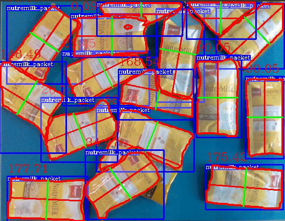
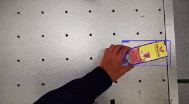

# **easy_perception_deployment**
[](https://github.com/ros-industrial/easy_perception_deployment/actions/workflows/industrial_ci_action.yml)
[](https://codecov.io/gh/ros-industrial/easy_perception_deployment)
[](https://opensource.org/licenses/Apache-2.0)
[](https://epd-docs.readthedocs.io/en/latest/?badge=latest)


## **What Is This?**

**easy_perception_deployment** is a ROS2 package that accelerates the **training** and **deployment** of **Computer Vision** (CV) models for industries.





## **Quality Declaration**

This package claims to be in the **Quality Level 4** category, see the [**Quality Declaration**](https://github.com/cardboardcode/easy_perception_deployment/blob/master/QUALITY_DECLARATION.md) for more details.

## **Setup**

This section lists steps on how to build **easy_perception_deployment** package using ROS2 build tools.

``` bash
# Create ROS2 workspace
cd $HOME
mkdir -p epd_ros2_ws/src && cd epd_ros2_ws/src

# Download fast and shallow copy of easy_perception_deployment
git clone https://github.com/ros-industrial/easy_perception_deployment.git \
--depth 1 --single-branch
cd easy_perception_deployment/easy_perception_deployment

# Start up GUI interface.
bash run.bash
```

## **Docs**

[Check out the full documentation here.](https://epd-docs.readthedocs.io/en/latest/)

## **Contributions & Feedback**

**We welcome contributions!** Please see the [contribution guidelines](https://github.com/ros-industrial/easy_perception_deployment/blob/master/CONTRIBUTING.md).

For **feature requests** or **bug reports**, please file a [GitHub Issue](https://github.com/ros-industrial/easy_perception_deployment/issues).

For **general discussion** or **questions**, please use [GitHub Discussions](https://github.com/ros-industrial/easy_perception_deployment/discussions).

## **Acknowledgements**

We would like to acknowledge the Singapore government for their vision and support to start this ambitious research and development project, "Accelerating Open Source Technologies for Cross Domain Adoption through the Robot Operating System". The project is supported by Singapore National Robotics Programme (NRP).

Any opinions, findings and conclusions or recommendations expressed in this material are those of the author(s) and do not reflect the views of the NR2PO.
